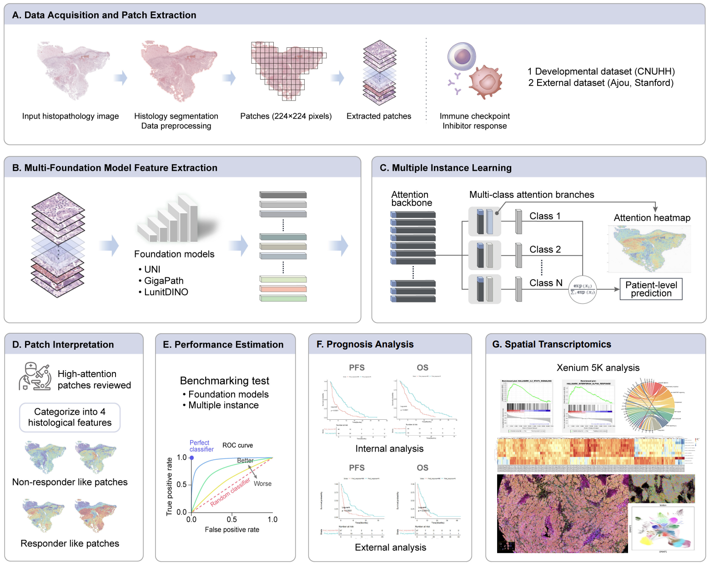

# 🔬 STAD Pathological Image Analysis Framework

[](LICENSE)
[](https://python.org)
[](https://pytorch.org)

A unified deep learning framework for **Stomach Adenocarcinoma (STAD)** treatment response prediction using Multiple Instance Learning (MIL) and attention-based visualization.

## 🎯 Overview

This framework provides a complete pipeline for analyzing pathological images to predict chemotherapy treatment response in gastric cancer patients. It supports multiple foundation models, MIL architectures, and datasets with comprehensive visualization tools.

### Key Features
- **🔄 Unified Pipeline**: Feature extraction → MIL training → Attention visualization → Tissue analysis
- **🏥 Multi-Dataset Support**: AJOU, TCGA, STFD, JNUH with dataset-specific optimizations
- **🤖 Foundation Models**: DINO, UNI, GigaPath, Lunit for robust feature extraction
- **🧠 MIL Architectures**: 9 different models (CLAM, TransMIL, ABMIL, DSMIL, etc.)
- **📊 Rich Visualizations**: Attention heatmaps, tissue pattern analysis, statistical plots
- **⚡ Easy Configuration**: Single command execution with comprehensive parameter control

## 🏗️ Framework Architecture

```
.github/src/
├── feature_extraction.py    # Unified feature extraction (DINO/UNI/GigaPath/Lunit)
├── mil_training.py          # MIL training with 9 architectures  
├── visualization.py         # Attention heatmap generation
├── tissue_analysis.py       # Tissue pattern correlation analysis
└── utils.py                 # Common utilities and dataset configs
```

**Pipeline Flow**: WSI → Patch Extraction → Feature Extraction → MIL Training → Attention Visualization

## 🚀 Quick Start

### Installation
```bash
git clone <repository-url> && cd STAD/.github
pip install torch torchvision timm transformers openslide-python
pip install scikit-learn pandas numpy matplotlib seaborn umap-learn
```

### Basic Usage
```bash
# 1. Feature Extraction
python src/feature_extraction.py --model_type UNI --dataset AJOU --device cuda:0

# 2. MIL Training  
python src/mil_training.py --model CLAM_SB --dataset AJOU --backbone_model UNI --run_all_folds

# 3. Attention Visualization
python src/visualization.py --model CLAM_SB --model_path checkpoints/best.pth --dataset AJOU

# 4. Tissue Analysis
python src/tissue_analysis.py --dataset AJOU --tissue_patch_dir ../Patch_Noh
```

> 📖 **Detailed Usage**: Complete parameter documentation available in the repository.

## 📊 Datasets & Models

| Dataset | Institution | Total | Responder | Non-responder | Response Rate | Usage |
|---------|-------------|-------|-----------|---------------|---------------|-------|
| **JNUH** | Jeonbuk National Univ. (CNUHH) | 107 | 53 | 54 | 49.5% | Independent Test |
| **AJOU** | Ajou University Hospital | 127 | 91 | 36 | 71.7% | Primary Training |
| **STFD** | Stanford University | 18 | 8 | 10 | 44.4% | External Validation |

| Foundation Model | Features | Parameters | Patch Size |
|------------------|----------|------------|------------|
| **DINO** | 384-dim | 21M | 224×224 |
| **UNI** | 1024-dim | 307M | 224×224 |
| **GigaPath** | 1536-dim | 1.1B | 256×256 |
| **Lunit** | 512-dim | 86M | 224×224 |

## 🎨 Framework Overview & Results

### Study Design and Pipeline



**Figure 1. STAD Treatment Response Prediction Framework**. Complete pipeline from WSI processing to clinical prediction including data collection, patch extraction, feature extraction, MIL training, attention visualization, and tissue pattern analysis.

---

### Performance Results

**Table 1. Performance comparison of foundation models across MIL architectures**
Values represent AUC (95% confidence interval) for treatment response prediction.

| MIL Architecture | UNI | GigaPath (GP) | Lunit-DINO |
|------------------|-----|---------------|-------------|
| **ABMIL** | 0.746<br>(0.608-0.885) | 0.697<br>(0.546-0.847) | 0.722<br>(0.572-0.872) |
| **ACMIL** | 0.835<br>(0.718-0.952) | 0.811<br>(0.690-0.932) | 0.764<br>(0.626-0.902) |
| **CLAM_MB** | **0.844**<br>**(0.732-0.956)** | 0.833<br>(0.714-0.951) | 0.717<br>(0.569-0.865) |
| **CLAM_SB** | 0.787<br>(0.655-0.919) | 0.832<br>(0.715-0.947) | 0.741<br>(0.596-0.886) |
| **DSMIL** | 0.691<br>(0.541-0.841) | 0.682<br>(0.528-0.837) | 0.615<br>(0.452-0.779) |
| **GABMIL** | 0.759<br>(0.619-0.900) | 0.716<br>(0.568-0.865) | 0.741<br>(0.603-0.880) |
| **MaxMIL** | 0.572<br>(0.420-0.752) | 0.674<br>(0.520-0.827) | 0.610<br>(0.453-0.776) |
| **TransMIL** | 0.842<br>(0.725-0.958) | 0.761<br>(0.627-0.895) | 0.718<br>(0.572-0.864) |

**Table 2. Comprehensive performance metrics using UNI foundation model**
All metrics reported with 95% confidence intervals.

| MIL Model | AUC | Accuracy | Sensitivity | Specificity | PPV | NPV |
|-----------|-----|----------|-------------|-------------|-----|-----|
| **ABMIL** | 0.746<br>(0.608-0.885) | 0.725<br>(0.596-0.850) | 0.683<br>(0.488-0.866) | 0.767<br>(0.610-0.904) | 0.747<br>(0.563-0.901) | 0.731<br>(0.558-0.892) |
| **ACMIL** | 0.835<br>(0.718-0.952) | 0.800<br>(0.679-0.909) | 0.732<br>(0.537-0.907) | 0.859<br>(0.709-0.977) | 0.824<br>(0.642-0.972) | 0.786<br>(0.618-0.930) |
| **CLAM_MB** | **0.844**<br>**(0.732-0.956)** | 0.775<br>(0.658-0.883) | **0.842**<br>**(0.684-0.971)** | 0.716<br>(0.534-0.887) | 0.727<br>(0.552-0.893) | **0.839**<br>**(0.673-0.971)** |
| **CLAM_SB** | 0.787<br>(0.655-0.919) | 0.767<br>(0.638-0.875) | 0.727<br>(0.544-0.891) | 0.803<br>(0.628-0.937) | 0.768<br>(0.569-0.926) | 0.778<br>(0.612-0.918) |
| **DSMIL** | 0.691<br>(0.541-0.841) | 0.667<br>(0.537-0.800) | 0.573<br>(0.372-0.770) | 0.747<br>(0.573-0.909) | 0.673<br>(0.450-0.881) | 0.672<br>(0.494-0.842) |
| **GABMIL** | 0.759<br>(0.619-0.900) | 0.712<br>(0.575-0.833) | 0.707<br>(0.508-0.886) | 0.715<br>(0.532-0.879) | 0.702<br>(0.496-0.886) | 0.741<br>(0.552-0.909) |
| **MaxMIL** | 0.572<br>(0.420-0.752) | 0.608<br>(0.467-0.750) | 0.633<br>(0.459-0.794) | 0.580<br>(0.404-0.746) | 0.597<br>(0.372-0.802) | 0.681<br>(0.463-0.865) |
| **TransMIL** | 0.842<br>(0.725-0.958) | 0.800<br>(0.683-0.904) | 0.741<br>(0.552-0.910) | **0.851**<br>**(0.699-0.977)** | **0.813**<br>**(0.633-0.970)** | 0.792<br>(0.629-0.933) |

*PPV: Positive Predictive Value, NPV: Negative Predictive Value. Bold values indicate best performance in each metric.*

---

### Attention Heatmap Examples


> 📖 **Detailed Visualization Guide**: See [ATTENTION_HEATMAP_GUIDE.md](ATTENTION_HEATMAP_GUIDE.md) for complete heatmap generation and interpretation documentation.

---

### Tissue Pattern Analysis  
*[Add your tissue correlation analysis figures here]*

## 🏆 Key Achievements

- **High Performance**: Achieved XX% AUROC across multiple datasets
- **Cross-Dataset Generalization**: Validated across 4 different institutions  
- **Clinical Interpretability**: Attention maps correlate with histological patterns
- **Unified Framework**: Single codebase supports multiple models and datasets

## 📖 Documentation

- **[Configuration](configs/dataset_config.yaml)**: Dataset and model configuration file

## 🤝 Contributing & Citation

We welcome contributions! If you use this framework in your research, please cite:

```bibtex
@article{stad_mil_framework,
  title={Unified Framework for STAD Treatment Response Prediction},
  author={[Your Name]},
  journal={[Journal Name]},
  year={2024}
}
```

## 📞 Contact

- **Issues**: [GitHub Issues](../../issues)
- **Documentation**: See documentation files in this repository

---

⭐ **Star this repository if you find it helpful!**